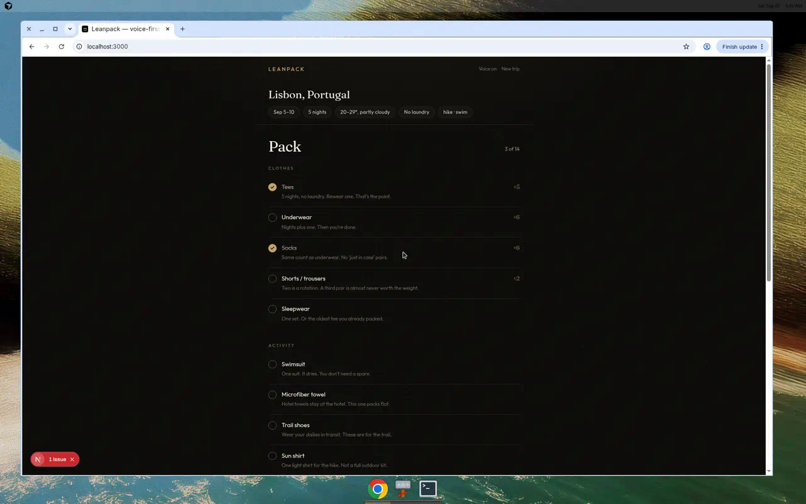

# Leanpack

A voice-first packing list for people who hate overpacking.

Tell it the city, how long you’ll be gone, and what you’ll actually do. It asks about laundry — because that changes the shirt count — then checks the weather and builds a small, opinionated checklist. Leave the second pair of jeans at home.

This is the app. There is no marketing page in front of it.



**Live demo:** TBD

## How it feels

- Speak the trip. The checklist stays on screen.
- Check items off by tap or by voice: *“packed charger”*, *“check off socks”*, *“what’s left?”*
- Weather comes from [Open-Meteo](https://open-meteo.com/) (free, no API key).
- The packing engine is deterministic and ruthless. Optional OpenAI only polishes the spoken replies.

## Run it locally

```bash
npm install
npm run dev
```

Open [http://localhost:3000](http://localhost:3000).

```bash
npm run build   # production build
npm test        # packing + conversation checks
```

No paid keys required.

### Voice (Chrome)

1. Use a current Chromium browser (Chrome, Edge, Arc).
2. Allow the microphone when asked.
3. **Desktop:** hold the large button and talk.
4. **Phone:** tap to talk, tap again when you’re done.

Safari and Firefox don’t expose `SpeechRecognition` the same way. The text field is the same conversation — destination, nights, activities, laundry, then voice commands once the list exists.

`speechSynthesis` reads replies back. Toggle **Voice on / Voice off** in the header if you want the room quiet.

### Optional OpenAI

Copy `.env.example` to `.env.local` and set `OPENAI_API_KEY` if you want warmer spoken copy. The checklist still comes from the local engine. The default demo path never depends on this.

## Packing rules

Clothes scale with nights and laundry. Mid-trip laundry halves the shirts. No laundry means nights + 1 of underwear and socks — not a new outfit for every dinner.

Weather decides layers and whether a rain shell earns its place. Activities add only what you can’t improvise: a suit and a microfiber towel for swimming, trail shoes for a hike, one athletic set for a run.

Toiletries stay travel-sized. Passport / ID and a charger are always there. The list should fit a thoughtful carry-on, not a packing blog.

## Stack

Next.js (App Router) · TypeScript · Tailwind CSS · Web Speech API · Open-Meteo

Trip and checklist persist in `localStorage` so a refresh doesn’t wipe packing progress.

## Out of scope

Accounts, sync, shopping links, itineraries, native apps.
